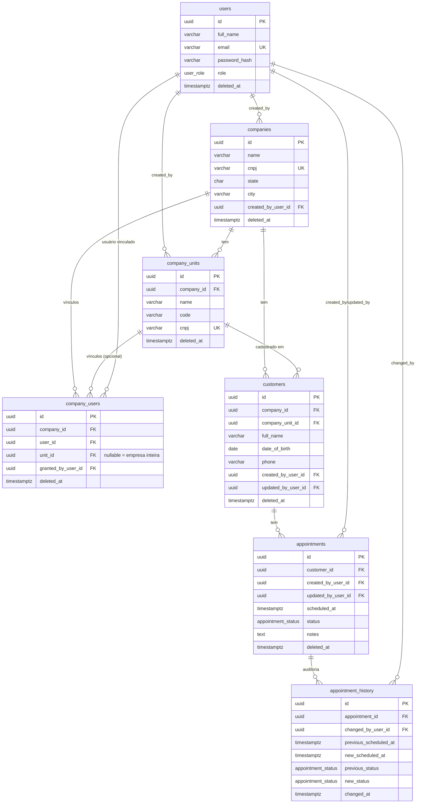

# Arquitetura — Ótica Lab API

Documentação completa da implementação: stack, camadas, modelo de domínio, autenticação/autorização, banco de dados, tratamento de erros, escalabilidade, testes e fluxo de trabalho.

## Sumário

- [Visão geral](#visão-geral)
- [Stack tecnológica](#stack-tecnológica)
- [Arquitetura em camadas](#arquitetura-em-camadas)
- [Estrutura de pastas](#estrutura-de-pastas)
- [Modelo de domínio](#modelo-de-domínio)
- [Autenticação e autorização](#autenticação-e-autorização)
- [Banco de dados](#banco-de-dados)
- [Tratamento de erros](#tratamento-de-erros)
- [Escalabilidade](#escalabilidade)
- [Testes](#testes)
- [Qualidade de código](#qualidade-de-código)
- [Fluxo Git](#fluxo-git)
- [Referência de endpoints](#referência-de-endpoints)
- [Documentação interativa](#documentação-interativa)

---

## Visão geral

Sistema multi-tenant para clínicas/óticas com múltiplas empresas (`companies`) e unidades (`company_units`). Cada empresa pode ter várias unidades; cada cliente (`customers`) é cadastrado numa unidade específica; cada agendamento (`appointments`) herda a empresa/unidade do seu cliente.

```
company (empresa)
  └── company_unit (unidade/filial)
        └── customer (cliente, cadastrado numa unidade específica)
              └── appointment (agendamento, herda empresa/unidade do cliente)
```

O acesso de um usuário a uma empresa/unidade é controlado por vínculos em `company_users`, exceto para `super_admin`, que tem acesso global sem precisar de vínculo explícito.

## Stack tecnológica

| Camada | Escolha | Por quê |
|---|---|---|
| Framework HTTP | FastAPI | Async nativo, validação via Pydantic, OpenAPI automático |
| Validação/serialização | Pydantic v2 | Schemas tipados, `Field` com descrição/exemplo, validação declarativa |
| Persistência | Supabase self-hosted (PostgREST) via `supabase-py` | Banco já rodando na VPS do cliente; API REST sobre Postgres sem precisar de driver SQL direto |
| Autenticação | JWT (`python-jose`) + `bcrypt` | Stateless, sem sessão de servidor — necessário para escalar horizontalmente |
| Lint/format | `ruff` | Uma ferramenta só cobre o que flake8+isort+black fariam juntos |
| Type-check | `mypy --strict` | Pega erros de tipo antes de rodar |
| Testes | `pytest` + `httpx`/`TestClient` | Testes de service (com repositories falsos) e de router (com `TestClient` + `dependency_overrides`) |
| Container | Docker multi-stage | Imagem final sem toolchain de build, usuário non-root |

Não usamos SQLAlchemy/Alembic: como o acesso ao banco é via SDK do Supabase (PostgREST), não existe uma engine SQL local — as migrations são arquivos `.sql` versionados em [`db/migrations/`](../db/migrations/), aplicados manualmente no Supabase Studio.

## Arquitetura em camadas

Cada feature segue o mesmo fluxo unidirecional:

```
HTTP → Router → Service → Repository → Supabase (PostgREST) → Postgres
```

| Camada | Responsabilidade | Não deve |
|---|---|---|
| **Router** | Traduzir HTTP ↔ chamada de aplicação; declarar schemas, status codes, docs OpenAPI | Conter SQL, regra de negócio, ou lidar com o ORM diretamente |
| **Service** | Regras de negócio, casos de uso, coordenação entre repositories | Conhecer FastAPI/HTTP, montar resposta HTTP |
| **Repository** | Encapsular acesso a dados (Supabase/PostgREST), traduzir erros de banco em exceções de domínio | Decidir regra de negócio (ex: "usuário pode fazer isso?") |
| **Model** | Representação tipada de uma linha do banco (`dataclass` congelado), usado internamente | Conter regra de negócio |
| **Schema** | Contrato HTTP de entrada/saída (Pydantic), nunca é o mesmo objeto que o Model | Acessar banco |
| **Exceptions** | Exceções específicas da feature + registro do handler que as traduz em resposta HTTP | — |
| **Dependencies** | Fiação de injeção de dependência (`Depends`) da feature | — |

Essa separação é a mesma em toda feature nova — ver [`app/customers/`](../app/customers/) como referência mínima e [`app/companies/`](../app/companies/) como exemplo de uma feature que cresceu (3 entidades relacionadas: `Company`, `CompanyUnit`, `CompanyUserLink`).

## Estrutura de pastas

```
app/
├── main.py                    # composição: FastAPI(), handlers, routers, metadata OpenAPI
│
├── core/
│   ├── config.py               # Settings (pydantic-settings), lê .env
│   ├── database.py              # client Supabase singleton (lock-guarded) + shutdown gracioso
│   ├── dependencies.py           # SupabaseClient, get_token_payload (agnóstico de feature)
│   ├── exceptions.py              # NotFoundError/UnauthorizedError/ForbiddenError globais
│   └── security.py                 # hash/verify de senha (bcrypt), JWT (jose)
│
├── shared/
│   ├── pagination.py            # Page[T] / PaginationParams genéricos
│   └── utils/postgrest.py        # as_row/as_rows — narrowing de tipo pro retorno do PostgREST
│
├── auth/          → POST /auth/login
├── users/          → CRUD de usuários + get_current_user + require_role()
├── companies/       → empresas + unidades + vínculos de acesso (company_users)
├── customers/         → CRUD de clientes, com auto-preenchimento de empresa/unidade
└── appointments/        → CRUD de agendamentos + histórico de auditoria imutável
```

Cada feature (exceto `core`/`shared`) tem: `__init__.py`, `model.py`, `schema.py`, `repository.py`, `service.py`, `router.py`, `exceptions.py`, `dependencies.py`.

**Regra de importação**: uma feature pode importar `core`, `shared`, e outras features quando existir uma dependência real de domínio (`appointments` → `customers` → `companies`, `companies` → `users`). `core` e `shared` **nunca** importam de uma feature — por isso `get_current_user`/`require_role()`, que dependem de `UserRepository`, vivem em `app/users/dependencies.py` e não em `core/dependencies.py`.

## Modelo de domínio



`appointment_history` é a única tabela sem soft delete — é *append-only*: um trigger (`trg_appointment_history_immutable`) recusa qualquer `UPDATE`/`DELETE`, mesmo para um superusuário do Postgres.

## Autenticação e autorização

### Fluxo

1. `POST /auth/login` com e-mail/senha → devolve um JWT (expira em 60 min).
2. Toda rota protegida exige `Authorization: Bearer <token>`.
3. `get_current_user` ([`app/users/dependencies.py`](../app/users/dependencies.py)) decodifica o token, busca o usuário no banco (verifica que não está soft-deletado) e injeta o objeto `User` completo no endpoint.

Não existe auto-registro. O primeiro usuário (`super_admin`) é inserido manualmente no banco — veja [`db/migrations/README.md`](../db/migrations/README.md).

### Papéis (roles)

| Role | Escopo de acesso | Ao cadastrar um cliente |
|---|---|---|
| `super_admin` | Global — todas as empresas/unidades, sem precisar de vínculo | Deve informar `company_id` **e** `company_unit_id` explicitamente |
| `admin` | Toda a empresa vinculada (vínculo com `unit_id = NULL`) | `company_id` automático; `company_unit_id` ainda precisa ser escolhido |
| `manager` | Uma unidade específica — **nunca** a empresa inteira (reforçado por trigger no banco) | Ambos automáticos (só tem acesso a uma unidade) |
| `attendant` | Empresa inteira OU unidade(s) específica(s) | Automático se vinculado a exatamente uma unidade; senão precisa escolher |

Só `super_admin` cria empresas, unidades e outros usuários (`require_role(UserRole.SUPER_ADMIN)`). Conceder/revogar acesso (`company_users`) exige `super_admin` **ou** `admin` com vínculo de empresa inteira na empresa em questão.

### Algoritmo de auto-preenchimento

Implementado em `CompanyUserService.resolve_company_and_unit()` ([`app/companies/service.py`](../app/companies/service.py)), chamado por `CustomerService.create()`:

```
se role == super_admin:
    exige company_id E company_unit_id explícitos → senão 400

senão:
    se company_id não informado:
        se usuário tem vínculo em exatamente 1 empresa → usa ela
        senão → 400 (ambíguo, precisa escolher)
    senão:
        verifica que o usuário tem vínculo nessa empresa → senão 403

    se company_unit_id não informado:
        se o vínculo na empresa é de unidade específica única → usa ela
        se o vínculo é de empresa inteira (unit_id NULL) → 400 (precisa escolher a unidade)
        se há vínculos em mais de uma unidade → 400 (ambíguo)
    senão:
        verifica que o usuário tem acesso a essa unidade → senão 403
```

Essa mesma lógica de checagem de acesso (`has_unit_access`/`has_company_admin_access`) é reaproveitada por `AppointmentService` (o agendamento herda empresa/unidade do cliente, e o serviço confirma que o usuário autenticado tem acesso a essa unidade antes de criar/editar).

### Defesa em profundidade: app + banco

Toda regra de autorização é implementada **duas vezes**, de propósito:

1. **No banco** (triggers `enforce_customer_company_access`, `enforce_appointment_company_access`, `enforce_company_users_manager_requires_unit`, função `user_has_unit_access()`) — é a fonte de verdade, vale mesmo que a aplicação tenha um bug ou que alguém edite dados direto no Supabase Studio.
2. **Na aplicação** (`CompanyUserService`) — produz um erro 400/403 limpo e específico **antes** de bater no banco, em vez de deixar a exceção crua do Postgres (`RAISE EXCEPTION`) vazar como um erro genérico.

## Banco de dados

### Soft delete

Toda tabela (exceto `appointment_history`) usa `deleted_at TIMESTAMPTZ` em vez de `DELETE` físico. Todo repository filtra `deleted_at IS NULL` em leituras, e "excluir" é sempre um `UPDATE` setando `deleted_at = now()`.

Implicação real encontrada em produção: **unique constraints não excluem linhas soft-deleted** (ex: `uq_companies_cnpj`, `uq_users_email`) — um CNPJ ou e-mail usado uma vez fica "reservado" para sempre, mesmo depois de soft-deletado. Isso é intencional no schema fornecido; a collection do Postman gera valores únicos por execução exatamente por causa disso (veja [Postman](#documentação-interativa)).

### Migrations

Sem Alembic — [`db/migrations/0001_initial_schema.sql`](../db/migrations/0001_initial_schema.sql) é aplicado manualmente no SQL Editor do Supabase Studio. Mudanças futuras viram um novo arquivo `0002_...sql`, nunca uma edição do que já foi aplicado.

[`0002_security_hardening.sql`](../db/migrations/0002_security_hardening.sql) (aplicar depois da `0001`) adiciona:

- `ENABLE ROW LEVEL SECURITY` + `REVOKE ALL ... FROM anon, authenticated` em todas as tabelas — a API só acessa o banco via `service_role` (que ignora RLS), então isso é defesa em profundidade contra um eventual vazamento futuro da chave `anon`.
- `SELECT ... FOR SHARE` nas 4 funções de trigger que liam o estado "ativo" (`deleted_at`) de um registro-pai sem travar a linha, fechando uma corrida onde a desativação concorrente da empresa/unidade/cliente-pai podia deixar um filho "vivo" pendurado num pai já desativado.
- `SET search_path = public` em toda function, hardening padrão contra manipulação de `search_path`.
- Tabela `login_attempts`, usada pelo rate limiting de `POST /auth/login` (veja abaixo).

### Rate limiting de login

`POST /auth/login` bloqueia (`429`) após 5 tentativas com falha para o mesmo e-mail em 15 minutos. O contador vive na tabela `login_attempts` (Postgres), não em memória do processo — necessário para a API escalar horizontalmente sem estado compartilhado entre instâncias. Cada tentativa (sucesso ou falha) também é registrada ali, servindo de trilha de auditoria básica de login.

### Função RPC para auditoria atômica

`PUT /appointments/{id}` precisa que o `UPDATE` em `appointments` e o `INSERT` em `appointment_history` aconteçam **na mesma transação**. Como o SDK do Supabase faz uma chamada HTTP por operação (sem transação entre duas chamadas da aplicação), a única forma correta é uma function no próprio Postgres:

```sql
update_appointment_with_history(p_appointment_id, p_changed_by_user_id, ...)
```

chamada via `client.rpc(...)` em [`app/appointments/repository.py`](../app/appointments/repository.py). Ela faz `SELECT ... FOR UPDATE`, o `UPDATE`, e o `INSERT` do histórico dentro da mesma transação SQL, e levanta `ERRCODE = 'P0002'` se o agendamento não existir — traduzido pela aplicação em `404`.

## Tratamento de erros

Cada feature define suas próprias exceções (`XNotFoundError`, `XAlreadyExistsError`, etc.) e registra um handler que as traduz em `JSONResponse`. Nunca há `raise HTTPException` dentro de service/repository — a camada HTTP só existe no router/handler.

| Situação | Exceção | HTTP |
|---|---|---|
| Recurso não encontrado (ou soft-deletado) | `XNotFoundError` | 404 |
| Violação de constraint única (ex: CNPJ, e-mail, cliente duplicado) | `XAlreadyExistsError` | 409 |
| Token ausente/inválido | `UnauthorizedError` (core) | 401 |
| Role/acesso insuficiente | `ForbiddenError` (core) | 403 |
| `company_id`/`company_unit_id` ambíguos ou faltando | `CompanyOrUnitRequiredError` | 400 |
| `manager` vinculado sem unidade específica | `ManagerRequiresUnitError` | 400 |
| Credenciais de login inválidas | `InvalidCredentialsError` | 401 |
| Validação de schema (Pydantic) | — | 422 |

Repositories traduzem erros do Postgres (`APIError.code`) em exceções de domínio — ex: `23505` (unique_violation) → `XAlreadyExistsError`; `P0002` (customizado na function RPC) → `AppointmentNotFoundError`.

## Escalabilidade

Requisito explícito do projeto: a API precisa escalar tanto verticalmente (mais CPU/RAM por instância) quanto horizontalmente (mais réplicas atrás de um load balancer).

- **Stateless**: autenticação via JWT, sem sessão de servidor. Nenhuma feature guarda estado em memória do processo.
- **Singleton do client Supabase com lock** ([`app/core/database.py`](../app/core/database.py)): `asyncio.Lock` com double-checked locking evita criar clients duplicados sob concorrência na inicialização.
- **Shutdown gracioso**: o `lifespan` do FastAPI fecha a sessão HTTP do client Supabase no encerramento — evita conexões penduradas ao escalar/reiniciar réplicas.
- **Docker multi-stage** ([`Dockerfile`](../Dockerfile)): imagem final sem toolchain de build, usuário non-root, número de workers configurável via `WEB_CONCURRENCY` (escala vertical de uma única instância).
- **Sem estado no Postgres direto**: acesso via PostgREST, que já faz pooling do lado do Supabase — a aplicação nunca gerencia um pool de conexões próprio.

## Testes

61 testes, duas estratégias por feature (conforme o documento de arquitetura original do projeto):

- **Testes de service**: repositories falsos (fakes in-memory), testando regra de negócio isolada — inclusive todas as combinações do algoritmo de auto-preenchimento por role.
- **Testes de router**: `TestClient` do FastAPI + `dependency_overrides`, testando o contrato HTTP (status codes, autenticação, serialização).

```bash
.venv/bin/pytest -v
```

Além dos testes automatizados, a [collection do Postman](#documentação-interativa) foi validada via `newman` (CLI oficial do Postman) **contra o Supabase self-hosted real**, duas vezes seguidas sem reset manual, confirmando que a documentação bate com o comportamento real da API em produção.

## Qualidade de código

- `ruff check` + `ruff format` — lint e formatação.
- `mypy --strict` — checagem de tipos.
- `pre-commit` roda os três em todo commit automaticamente.

Comentários no código só existem quando explicam um "porquê" não óbvio (uma decisão, uma restrição do schema, um workaround) — nunca para descrever o que uma linha já diz sozinha.

## Fluxo Git

- **Conventional Commits** (`feat:`, `fix:`, `chore:`, ...).
- **Trunk-based com PR obrigatório**: `main` nunca recebe push direto; toda mudança nasce num branch (`feat/...`, `fix/...`, `chore/...`) e entra via Pull Request, com squash-merge.

## Referência de endpoints

Documentação completa e interativa de cada endpoint (parâmetros, schemas, exemplos, todos os códigos de erro possíveis) está no Swagger — veja [Documentação interativa](#documentação-interativa). Resumo:

| Recurso | Endpoints | Quem pode |
|---|---|---|
| Auth | `POST /auth/login` | Público |
| Users | `POST` `PUT` `DELETE /users` | `super_admin` |
| Users | `GET /users`, `GET /users/{id}` | Qualquer autenticado |
| Companies | `POST` `PUT` `DELETE /companies` | `super_admin` |
| Companies | `GET /companies` (escopado), `GET /companies/{id}` | Qualquer autenticado |
| Company Units | `POST` `PUT` `DELETE /companies/{id}/units` | `super_admin` |
| Company Units | `GET /companies/{id}/units[/{id}]` | Qualquer autenticado |
| Access Grants | `POST /companies/{id}/users`, `DELETE .../users/{link_id}` | `super_admin` ou `admin` da empresa |
| Access Grants | `GET /companies/{id}/users` | `super_admin` ou `admin` da empresa |
| Customers | `POST` `PUT /customers` | Autenticado com acesso à unidade |
| Customers | `GET /customers`, `DELETE /customers/{id}` | Qualquer autenticado |
| Appointments | `POST` `PUT /appointments` | Autenticado com acesso à unidade do cliente |
| Appointments | `GET /appointments`, `GET .../history`, `DELETE /appointments/{id}` | Qualquer autenticado |
| Health | `GET /health` | Público |

## Documentação interativa

- **Swagger UI**: `http://localhost:8000/docs` — todo endpoint tem descrição, exemplos de request/response, e a lista completa de status codes possíveis (incluindo 400/401/403/404/409/422 quando aplicável).
- **ReDoc**: `http://localhost:8000/redoc` — mesma spec, layout alternativo.
- **OpenAPI JSON bruto**: `http://localhost:8000/openapi.json`.
- **Postman**: [`docs/postman/OticaLabV1-API.postman_collection.json`](postman/OticaLabV1-API.postman_collection.json) — 49 requests em 7 pastas (Health, Auth, Users, Companies, Customers, Appointments, Cleanup), cobrindo todo caminho feliz **e** os principais casos de erro. Autenticação e encadeamento de IDs entre requests são automáticos via scripts de teste (`pm.collectionVariables`) — rode as pastas em ordem, de cima para baixo. A pasta **Cleanup**, no fim, reverte tudo (soft delete), deixando a coleção pronta para rodar de novo do zero.
